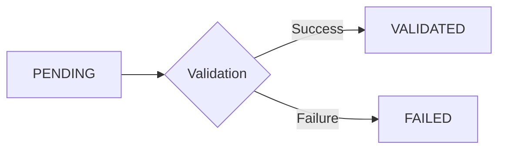

# Adapters

Adapters handle communication with external data sources and sinks in FlowSchema. They provide a pluggable interface for reading from and writing to various data formats.

## Architecture

FlowSchema uses three types of adapters:

- **Input Adapter**: Fetches data from a source
- **Output Adapter**: Persists processed data to a destination
- **Error Output Adapter**: Captures records that failed validation

---

## Input Adapters

Input adapters are responsible for reading data from various sources and converting them into a stream of entries.

### [CSV Input Adapter](adapters/csv-input.md)

Reads data from CSV files with extensive configuration options.

**Features:** Configurable encoding, custom delimiters, skip rows, field mapping

**[View Documentation →](adapters/csv-input.md)**

---

### [JSON Input Adapter](adapters/json-input.md)

Reads data from JSON files in both array and JSONL formats.

**Features:** Streaming parsing, multiple formats (array/JSONL), memory-efficient

**[View Documentation →](adapters/json-input.md)**

---

### [Arrow Input Adapter](adapters/arrow-input.md)

Reads data from Apache Parquet and other Arrow-compatible formats.

**Features:** Partitioned datasets, column selection, predicate pushdown, multiple formats

**[View Documentation →](adapters/arrow-input.md)**

---

### [File Partitioner](adapters/file-partitioner.md)

Partitions large files into byte ranges for distributed processing.

**Features:** Byte-range partitioning, distributed processing, memory efficient, worker integration

**[View Documentation →](adapters/file-partitioner.md)**

---

## Output Adapters

Output adapters are responsible for persisting processed data to various destinations.

### [CSV Output Adapter](adapters/csv-output.md)

Writes validated entries to a CSV file.

**Features:** Automatic CSV writing, custom delimiters, efficient buffering

**[View Documentation →](adapters/csv-output.md)**

---

### [JSON Output Adapter](adapters/json-output.md)

Writes validated entries to JSON files in array or JSONL format.

**Features:** Pretty-printing, metadata inclusion, handles UUIDs/Enums

**[View Documentation →](adapters/json-output.md)**

---

### [Arrow Output Adapter](adapters/arrow-output.md)

Writes validated entries to Apache Parquet files using PyArrow.

**Features:** Columnar storage, batched writing, schema flexibility, compression options

**[View Documentation →](adapters/arrow-output.md)**

---

### [Memory Output Adapter](adapters/memory-output.md)

Stores all processed entries in an in-memory list for testing and debugging.

**Features:** Zero-config, direct access via `.results`, no I/O overhead

**[View Documentation →](adapters/memory-output.md)**

---

### [Generator Output Adapter](adapters/generator-output.md)

Provides an iterator interface to consume validation results in real-time.

**Features:** Iterator pattern, queue-based streaming, backpressure control, real-time processing

**[View Documentation →](adapters/generator-output.md)**

---

### Queue Adapters

Bridges the gap between external applications and FlowSchema's pipeline using thread-safe or async queues.

#### Async Queues
Used for `asyncio` based applications (FastAPI, WebSockets).

**AsyncQueueInputAdapter**
- Wraps an `asyncio.Queue` for input
- Efficiently feeds items from an async loop into the pipeline
- Sentinel support for graceful shutdown

**AsyncQueueOutputAdapter**
- Wraps an `asyncio.Queue` for output
- Pushes processing results back into an async loop

#### Synchronous Queues
Used for standard multi-threaded applications.

**QueueInputAdapter**
- Wraps a standard `queue.Queue`
- Fetches items from a thread-safe queue

**QueueOutputAdapter**
- Wraps a standard `queue.Queue`
- Pushes processing results into a thread-safe queue

**Example (Async):**
```python
from flowschema import FlowSchema
from flowschema.input_adapter.queue import AsyncQueueInputAdapter
from flowschema.output_adapter.queue import AsyncQueueOutputAdapter

flow = FlowSchema(
    input_adapter=AsyncQueueInputAdapter(input_queue),
    output_adapter=AsyncQueueOutputAdapter(output_queue),
    executor=executor
)
```

**Example (Sync):**
```python
from flowschema import FlowSchema
from flowschema.input_adapter.queue import QueueInputAdapter
from flowschema.output_adapter.queue import QueueOutputAdapter

flow = FlowSchema(
    input_adapter=QueueInputAdapter(input_queue),
    output_adapter=QueueOutputAdapter(output_queue),
    executor=executor
)
```

---

### Dummy Output Adapter

A no-op output adapter for cases where hooks handle all output.

**Use Cases:**
- Hooks write to database/API
- Side-effects only processing
- Maximum performance with hook-based output

**Example:**
```python
from flowschema import FlowSchema
from flowschema.output_adapter.dummy import DummyOutputAdapter

flow = FlowSchema(
    input_adapter=input_adapter,
    output_adapter=DummyOutputAdapter(),  # No output overhead
    post_validation_hooks=[DBWriterHook()],  # Hook writes data
)
```

---

## Hooks System

### [Hooks Documentation](adapters/hooks.md)

Transform and enrich data at various pipeline stages.

**Built-in Hooks:**
- **TimestampHook**: Add timestamps to data
- **FieldMapperHook**: Rename/map fields
- **Custom Hooks**: Create your own transformations

**[View Documentation →](adapters/hooks.md)**

---

## Custom Adapters

### [Creating Custom Adapters](adapters/custom-adapters.md)

Learn how to build your own input and output adapters for specialized data sources.

**Base Classes:**
- `BaseInputAdapter` - Synchronous input
- `BaseAsyncInputAdapter` - Async input
- `BaseOutputAdapter` - Synchronous output
- `BaseAsyncOutputAdapter` - Async output

**[View Documentation →](adapters/custom-adapters.md)**

---

## The Entry Object

Every record in FlowSchema is wrapped in an `EntryTypedDict`, which tracks its lifecycle through the pipeline.

### Entry Structure

```python
{
    "id": uuid.UUID,
    "position": int,
    "status": EntryStatus,
    "raw_data": dict[str, Any],
    "validated_data": dict[str, Any] | None,
    "errors": list[str],
    "metadata": dict[str, Any]
}
```

### Fields

- **`id`**: A unique `uuid.UUID` for the record
- **`position`**: The original index/line number in the source
- **`status`**: One of:
  - `PENDING`: Entry has been created but not processed
  - `VALIDATED`: Entry passed validation
  - `FAILED`: Entry failed validation
- **`raw_data`**: The original dictionary extracted from the input
- **`validated_data`**: The data after being parsed and validated by Pydantic
- **`errors`**: A list of validation error messages (if any)
- **`metadata`**: Additional context or custom data

### Entry Status Flow



---

## Quick Examples

### CSV Processing

```python
from flowschema import FlowSchema
from flowschema.executor.sync_fifo import SyncFifoExecutor
from flowschema.input_adapter.csv import CSVInputAdapter
from flowschema.output_adapter.csv import CSVOutputAdapter

flow = FlowSchema(
    input_adapter=CSVInputAdapter("input.csv"),
    output_adapter=CSVOutputAdapter("output.csv"),
    error_output_adapter=CSVOutputAdapter("errors.csv"),
    executor=SyncFifoExecutor(YourSchema)
)
```

### JSON Processing

```python
from flowschema import FlowSchema
from flowschema.executor.sync_fifo import SyncFifoExecutor
from flowschema.input_adapter.json import JSONInputAdapter
from flowschema.output_adapter.json import JSONOutputAdapter

flow = FlowSchema(
    input_adapter=JSONInputAdapter("input.json", format="array"),
    output_adapter=JSONOutputAdapter("output.json", indent=2),
    executor=SyncFifoExecutor(YourSchema)
)
```

### With Hooks

```python
from flowschema.hooks.builtin import TimestampHook

flow = FlowSchema(
    input_adapter=input_adapter,
    output_adapter=output_adapter,
    executor=executor,
    post_validation_hooks=[TimestampHook(field_name="processed_at")]
)
```

---

## Future Adapters

The following adapters are planned for future releases:

- **SQLInputAdapter / SQLOutputAdapter**: For database connections
- **API adapters**: For REST API integration
- **KafkaInputAdapter / KafkaOutputAdapter**: For Apache Kafka streams

To request a new adapter, please open an issue on GitHub.

