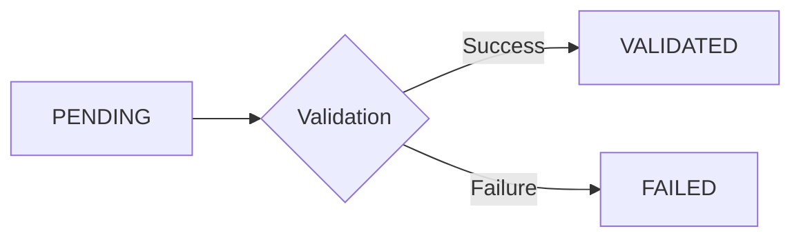

# Adapters

Adapters handle the communication with external data sources and sinks in FlowSchema. They provide a pluggable interface for reading from and writing to various data formats.

## Architecture

FlowSchema uses three types of adapters:

- **Input Adapter**: Fetches data from a source
- **Output Adapter**: Persists processed data to a destination
- **Error Output Adapter**: Captures records that failed validation

---

## Input Adapters

Input adapters are responsible for reading data from various sources and converting them into a stream of entries.

### CSVInputAdapter

Reads data from CSV files with extensive configuration options.

#### Features

- Configurable encoding
- Custom delimiters
- Skip rows (e.g., headers)
- Limit number of rows to process
- Custom field names

#### Usage

```python
from flowschema.input_adapter.csv import CSVInputAdapter

input_adapter = CSVInputAdapter(
    filepath="data.csv",
    encoding="utf-8",
    delimiter=",",
    skip_rows=0,
    max_rows=None,
    fieldnames=None
)
```

#### Parameters

- `filepath` (required): Path to the CSV file
- `encoding` (optional): File encoding. Default: `"utf-8"`
- `delimiter` (optional): CSV delimiter character. Default: `","`
- `skip_rows` (optional): Number of rows to skip from the beginning. Default: `0`
- `max_rows` (optional): Maximum number of rows to read. `None` means all rows. Default: `None`
- `fieldnames` (optional): Custom field names for the CSV. If `None`, uses the first row. Default: `None`

#### Example: Custom Configuration

```python
adapter = CSVInputAdapter(
    filepath="data.csv",
    delimiter=";",
    skip_rows=1,
    max_rows=1000,
    encoding="latin-1"
)
```

### BaseInputAdapter

Abstract base class for creating custom input adapters.

#### Creating a Custom Input Adapter

```python
from flowschema.input_adapter.base import BaseInputAdapter
from flowschema.models.core import EntryTypedDict
import typing

class MyCustomInputAdapter(BaseInputAdapter):
    def __init__(self, source_config):
        self.source_config = source_config
    
    @property
    def generator(self) -> typing.Generator[dict[str, typing.Any], None, None]:
        for raw_data in self._fetch_data():
            yield raw_data
    
    def _fetch_data(self):
        pass
```

### BaseAsyncInputAdapter

Abstract base class for creating async input adapters.

```python
from flowschema.input_adapter.base_async import BaseAsyncInputAdapter

class MyAsyncInputAdapter(BaseAsyncInputAdapter):
    @property
    async def generator(self):
        async for raw_data in self._fetch_data_async():
            yield raw_data
    
    async def _fetch_data_async(self):
        pass
```

---

## Output Adapters

Output adapters are responsible for persisting processed data to various destinations.

### CSVOutputAdapter

Writes validated entries to a CSV file.

#### Features

- Automatic CSV writing
- Configurable encoding
- Custom delimiters
- Handles Entry objects automatically
- Efficient buffered writing

#### Usage

```python
from flowschema.output_adapter.csv import CSVOutputAdapter

output_adapter = CSVOutputAdapter(
    filepath="output.csv",
    encoding="utf-8",
    delimiter=","
)
```

#### Parameters

- `filepath` (required): Path to the output CSV file
- `encoding` (optional): File encoding. Default: `"utf-8"`
- `delimiter` (optional): CSV delimiter character. Default: `","`

#### Example: Error Output

```python
error_adapter = CSVOutputAdapter(
    filepath="errors.csv",
    delimiter="|"
)
```

### BaseOutputAdapter

Abstract base class for creating custom output adapters.

#### Creating a Custom Output Adapter

```python
from flowschema.output_adapter.base import BaseOutputAdapter
from flowschema.models.core import EntryTypedDict

class MyCustomOutputAdapter(BaseOutputAdapter):
    def __init__(self, destination_config):
        self.destination_config = destination_config
    
    def write(self, entry: EntryTypedDict) -> None:
        pass
    
    def close(self) -> None:
        pass
```

### BaseAsyncOutputAdapter

Abstract base class for creating async output adapters.

```python
from flowschema.output_adapter.base_async import BaseAsyncOutputAdapter

class MyAsyncOutputAdapter(BaseAsyncOutputAdapter):
    async def write(self, entry: EntryTypedDict) -> None:
        pass
    
    async def close(self) -> None:
        pass
```

---

## The Entry Object

Every record in FlowSchema is wrapped in an `EntryTypedDict`, which tracks its lifecycle through the pipeline.

### Entry Structure

```python
{
    "id": uuid.UUID,
    "position": int,
    "status": EntryStatus,
    "raw_data": dict[str, Any],
    "validated_data": dict[str, Any] | None,
    "errors": list[str],
    "metadata": dict[str, Any]
}
```

### Fields

- **`id`**: A unique `uuid.UUID` for the record
- **`position`**: The original index/line number in the source
- **`status`**: One of:
  - `PENDING`: Entry has been created but not processed
  - `VALIDATED`: Entry passed validation
  - `FAILED`: Entry failed validation
- **`raw_data`**: The original dictionary extracted from the input
- **`validated_data`**: The data after being parsed and validated by Pydantic
- **`errors`**: A list of validation error messages (if any)
- **`metadata`**: Additional context or custom data

### Entry Status Flow



---

## Adapter Configuration Patterns

### Basic Pattern: CSV to CSV

```python
from flowschema.core import FlowSchema
from flowschema.input_adapter.csv import CSVInputAdapter
from flowschema.output_adapter.csv import CSVOutputAdapter
from flowschema.executor.sync_fifo import SyncFifoExecutor

flow = FlowSchema(
    input_adapter=CSVInputAdapter("input.csv"),
    output_adapter=CSVOutputAdapter("output.csv"),
    executor=SyncFifoExecutor(YourSchema)
)
```

### With Error Handling

```python
flow = FlowSchema(
    input_adapter=CSVInputAdapter("input.csv"),
    output_adapter=CSVOutputAdapter("output.csv"),
    error_output_adapter=CSVOutputAdapter("errors.csv"),
    executor=SyncFifoExecutor(YourSchema)
)
```

### Custom Delimiters

```python
flow = FlowSchema(
    input_adapter=CSVInputAdapter(
        "input.tsv",
        delimiter="\t"
    ),
    output_adapter=CSVOutputAdapter(
        "output.tsv",
        delimiter="\t"
    ),
    executor=SyncFifoExecutor(YourSchema)
)
```

---

## Future Adapters

The following adapters are planned for future releases:

- **ParquetInputAdapter / ParquetOutputAdapter**: For Apache Parquet files
- **SQLInputAdapter / SQLOutputAdapter**: For database connections
- **JSONInputAdapter / JSONOutputAdapter**: For JSON files and streams
- **API adapters**: For REST API integration
- **KafkaInputAdapter / KafkaOutputAdapter**: For Apache Kafka streams

To request a new adapter, please open an issue on GitHub.
