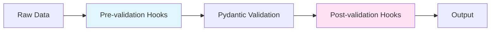

# Hooks System

The hooks system in ZooPipe allows you to inject custom logic at various stages of the data processing pipeline. Hooks enable powerful transformations, enrichments, validations, and side effects without modifying the core pipeline code.

---

## Overview

Hooks intercept and process data at two critical points:

1. **Pre-validation Hooks**: Execute **before** Pydantic validation on raw input data
2. **Post-validation Hooks**: Execute **after** successful validation on validated data

### Key Features

- **Batch Processing**: Hooks receive lists of entries for efficient processing
- **Async Support**: Hooks can be synchronous or asynchronous
- **Thread-Safe Store**: Shared state management across hook executions
- **Lifecycle Management**: `setup()` and `teardown()` for resource initialization/cleanup
- **Priority System**: Control execution order within the same hook stage
- **Error Handling**: Automatic error capturing and entry marking

---

## Core Concepts

### Entry Processing Model

Hooks receive a **list** of entries (not individual entries), allowing for:
- Batch API calls
- Efficient database lookups
- Parallel processing within hooks
- Resource reuse across multiple entries

### Hook Stages



**Pre-validation**: Modify raw data before validation (e.g., normalize fields, clean data)  
**Post-validation**: Enrich validated data (e.g., add timestamps, call APIs for enrichment)

---

## Creating Custom Hooks

### Basic Hook Template

```python
from zoopipe.hooks.base import BaseHook, HookStore
from zoopipe.models.core import EntryTypedDict

class MyCustomHook(BaseHook):
    def __init__(self, **kwargs):
        super().__init__(priority=50)  # Optional priority
        # Initialize hook-specific attributes
    
    def setup(self, store: HookStore) -> None:
        # Called once before processing starts
        # Initialize resources, connections, caches
        pass
    
    async def execute(
        self, 
        entries: list[EntryTypedDict], 
        store: HookStore
    ) -> list[EntryTypedDict]:
        # Called for each batch of entries
        # Modify entries in-place or return modified list
        
        for entry in entries:
            # Access raw data (pre-validation) or validated_data (post-validation)
            data = entry.get("validated_data") or entry.get("raw_data")
            
            # Modify data
            if data:
                data["custom_field"] = "value"
            
            # Add metadata
            entry["metadata"]["hook_processed"] = True
        
        return entries
    
    def teardown(self, store: HookStore) -> None:
        # Called once after all processing completes
        # Clean up resources, close connections
        pass
```

### Method Signatures

#### `setup(store: HookStore) -> None`
- **When**: Called **once** per worker before processing
- **Purpose**: Initialize resources (DB connections, HTTP sessions, caches)
- **Store**: Use to initialize shared state

#### `execute(entries: list[EntryTypedDict], store: HookStore) -> list[EntryTypedDict]`
- **When**: Called for **each batch** of entries
- **Purpose**: Transform, enrich, or validate entries
- **Return**: Modified list of entries
- **Can be async**: Use `async def execute(...)` for async operations

#### `teardown(store: HookStore) -> None`
- **When**: Called **once** per worker after processing
- **Purpose**: Cleanup resources
- **Store**: Access shared state for final operations (logging totals, closing connections)

---

## Basic Use Cases

### 1. Data Normalization

Clean and standardize data before validation:

```python
class NormalizationHook(BaseHook):
    async def execute(self, entries, store):
        for entry in entries:
            data = entry.get("raw_data")
            if data:
                # Trim whitespace
                if "name" in data:
                    data["name"] = data["name"].strip()
                
                # Lowercase email
                if "email" in data:
                    data["email"] = data["email"].lower()
                
                # Parse numbers
                if "age" in data and isinstance(data["age"], str):
                    try:
                        data["age"] = int(data["age"])
                    except ValueError:
                        pass
        
        return entries
```

### 2. Adding Metadata

Add timestamps, processing info, or tracking data:

```python
from datetime import datetime, timezone

class MetadataHook(BaseHook):
    async def execute(self, entries, store):
        now = datetime.now(timezone.utc).isoformat()
        
        for entry in entries:
            entry["metadata"]["processed_at"] = now
            entry["metadata"]["processor_version"] = "1.0.0"
            entry["metadata"]["entry_id"] = entry["id"]
        
        return entries
```

### 3. Field Transformation

Transform field values:

```python
class FieldTransformHook(BaseHook):
    def __init__(self, fields_to_uppercase: list[str]):
        super().__init__()
        self.fields = fields_to_uppercase
    
    async def execute(self, entries, store):
        for entry in entries:
            data = entry.get("validated_data") or entry.get("raw_data")
            if data:
                for field in self.fields:
                    if field in data and isinstance(data[field], str):
                        data[field] = data[field].upper()
        
        return entries

# Usage
pipe = Pipe(
    pre_validation_hooks=[FieldTransformHook(["country_code", "status"])],
    ...
)
```

---

## Advanced Use Cases

### 1. API Enrichment with Batching

Call external APIs efficiently using batching:

```python
import aiohttp
from collections import defaultdict

class UserEnrichmentHook(BaseHook):
    def __init__(self, api_url: str):
        super().__init__()
        self.api_url = api_url
        self.session = None
    
    def setup(self, store):
        # Initialize HTTP session (will be created in execute due to async)
        store["api_calls"] = 0
    
    async def execute(self, entries, store):
        if not self.session:
            self.session = aiohttp.ClientSession()
        
        # Collect user IDs to fetch
        user_ids = []
        for entry in entries:
            data = entry.get("validated_data", {})
            if "user_id" in data:
                user_ids.append(data["user_id"])
        
        # Batch API call (single request for all users)
        if user_ids:
            async with self.session.post(
                f"{self.api_url}/users/batch",
                json={"user_ids": user_ids}
            ) as response:
                user_data = await response.json()
                store["api_calls"] += 1
        
        # Enrich entries with fetched data
        user_map = {u["id"]: u for u in user_data.get("users", [])}
        
        for entry in entries:
            data = entry.get("validated_data", {})
            user_id = data.get("user_id")
            if user_id in user_map:
                entry["metadata"]["user_info"] = user_map[user_id]
        
        return entries
    
    def teardown(self, store):
        if self.session:
            import asyncio
            asyncio.run(self.session.close())
        
        print(f"Total API calls made: {store.get('api_calls', 0)}")
```

### 2. Database Lookups with Caching

Fetch data from database with intelligent caching:

```python
from sqlalchemy import create_engine
from sqlalchemy.orm import sessionmaker

class DatabaseLookupHook(BaseHook):
    def __init__(self, connection_string: str):
        super().__init__()
        self.connection_string = connection_string
        self.engine = None
        self.Session = None
    
    def setup(self, store):
        self.engine = create_engine(self.connection_string, pool_size=10)
        self.Session = sessionmaker(bind=self.engine)
        store["cache"] = {}  # Simple in-memory cache
        store["cache_hits"] = 0
        store["cache_misses"] = 0
    
    async def execute(self, entries, store):
        cache = store["cache"]
        session = self.Session()
        
        try:
            # Collect IDs to fetch (not in cache)
            ids_to_fetch = set()
            for entry in entries:
                data = entry.get("raw_data", {})
                product_id = data.get("product_id")
                if product_id and product_id not in cache:
                    ids_to_fetch.add(product_id)
            
            # Batch fetch from database
            if ids_to_fetch:
                results = session.execute(
                    "SELECT id, name, category FROM products WHERE id IN :ids",
                    {"ids": tuple(ids_to_fetch)}
                ).fetchall()
                
                for row in results:
                    cache[row[0]] = {"name": row[1], "category": row[2]}
                
                store["cache_misses"] += len(ids_to_fetch)
            
            # Enrich entries from cache
            for entry in entries:
                data = entry.get("raw_data", {})
                product_id = data.get("product_id")
                
                if product_id in cache:
                    data["product_name"] = cache[product_id]["name"]
                    data["product_category"] = cache[product_id]["category"]
                    store["cache_hits"] += 1
        
        finally:
            session.close()
        
        return entries
    
    def teardown(self, store):
        if self.engine:
            self.engine.dispose()
        
        print(f"Cache hits: {store.get('cache_hits', 0)}")
        print(f"Cache misses: {store.get('cache_misses', 0)}")
```

### 3. Rate Limiting

Control processing rate to avoid overwhelming external services:

```python
import asyncio
from datetime import datetime

class RateLimitHook(BaseHook):
    def __init__(self, requests_per_second: int):
        super().__init__()
        self.requests_per_second = requests_per_second
        self.min_interval = 1.0 / requests_per_second
    
    def setup(self, store):
        store["last_request_time"] = None
    
    async def execute(self, entries, store):
        last_time = store.get("last_request_time")
        
        if last_time:
            elapsed = datetime.now().timestamp() - last_time
            if elapsed < self.min_interval:
                await asyncio.sleep(self.min_interval - elapsed)
        
        store["last_request_time"] = datetime.now().timestamp()
        
        return entries
```

### 4. Custom Validation with Complex Logic

Add business logic validation beyond Pydantic schemas:

```python
class BusinessRuleValidationHook(BaseHook):
    async def execute(self, entries, store):
        for entry in entries:
            data = entry.get("validated_data")
            if not data:
                continue
            
            # Complex business rule: discounts can't exceed price
            if data.get("discount", 0) > data.get("price", 0):
                entry["status"] = "FAILED"
                entry["errors"].append(
                    "Business rule violation: discount exceeds price"
                )
            
            # Date consistency check
            if data.get("end_date") and data.get("start_date"):
                if data["end_date"] < data["start_date"]:
                    entry["status"] = "FAILED"
                    entry["errors"].append(
                        "Business rule violation: end_date before start_date"
                    )
        
        return entries
```

---

## Async Hooks

### When to Use Async

Use async hooks when performing:
- HTTP/API calls
- Async database queries
- File I/O operations
- Network operations

### Async HTTP Calls Example

```python
import aiohttp

class AsyncAPIHook(BaseHook):
    def __init__(self, api_url: str):
        super().__init__()
        self.api_url = api_url
    
    async def execute(self, entries, store):
        async with aiohttp.ClientSession() as session:
            # Process entries concurrently
            tasks = []
            for entry in entries:
                data = entry.get("validated_data", {})
                if "user_id" in data:
                    task = self._fetch_user_data(session, entry, data["user_id"])
                    tasks.append(task)
            
            # Wait for all requests to complete
            if tasks:
                await asyncio.gather(*tasks)
        
        return entries
    
    async def _fetch_user_data(self, session, entry, user_id):
        try:
            async with session.get(f"{self.api_url}/users/{user_id}") as resp:
                user_data = await resp.json()
                entry["metadata"]["user_details"] = user_data
        except Exception as e:
            entry["metadata"]["enrichment_error"] = str(e)
```

### Use with AsyncIOExecutor

Async hooks work best with `AsyncIOExecutor`:

```python
from zoopipe.executor.asyncio import AsyncIOExecutor

pipe = Pipe(
    input_adapter=input_adapter,
    output_adapter=output_adapter,
    executor=AsyncIOExecutor(YourSchema, concurrency=10),
    post_validation_hooks=[AsyncAPIHook("https://api.example.com")]
)
```

---

## The HookStore

The `HookStore` is a thread-safe dictionary for sharing state across hook executions.

### Basic Usage

```python
class CounterHook(BaseHook):
    def setup(self, store):
        store["count"] = 0
        store["errors"] = 0
    
    async def execute(self, entries, store):
        for entry in entries:
            store["count"] += 1
            if entry.get("status") == "FAILED":
                store["errors"] += 1
        return entries
    
    def teardown(self, store):
        print(f"Processed: {store['count']}, Errors: {store['errors']}")
```

### Caching Pattern

```python
class CachingHook(BaseHook):
    def setup(self, store):
        store["cache"] = {}
        store["cache_size_limit"] = 10000
    
    async def execute(self, entries, store):
        cache = store["cache"]
        
        for entry in entries:
            key = entry.get("raw_data", {}).get("lookup_key")
            
            # Check cache
            if key in cache:
                entry["metadata"]["cached_value"] = cache[key]
            else:
                # Fetch and cache
                value = await self._fetch_value(key)
                
                # Simple LRU: clear cache if too large
                if len(cache) > store["cache_size_limit"]:
                    cache.clear()
                
                cache[key] = value
                entry["metadata"]["cached_value"] = value
        
        return entries
```

### Resource Pooling

Share expensive resources (database connections, HTTP sessions):

```python
import aiohttp

class PooledSessionHook(BaseHook):
    def setup(self, store):
        # Create session pool (one per worker)
        connector = aiohttp.TCPConnector(limit=100, limit_per_host=30)
        store["session"] = aiohttp.ClientSession(connector=connector)
    
    async def execute(self, entries, store):
        session = store["session"]
        
        # Use shared session for all requests
        for entry in entries:
            async with session.get("https://api.example.com/data") as resp:
                data = await resp.json()
                entry["metadata"]["api_data"] = data
        
        return entries
    
    def teardown(self, store):
        session = store.get("session")
        if session:
            import asyncio
            asyncio.run(session.close())
```

---

## Lifecycle Management

### Setup Phase

Called once per worker before processing starts:

```python
def setup(self, store):
    # Initialize resources
    self.db_connection = create_db_connection()
    store["connection"] = self.db_connection
    
    # Pre-load data
    store["lookup_table"] = self._load_lookup_table()
    
    # Initialize counters
    store["processed"] = 0
    store["errors"] = 0
```

### Teardown Phase

Called once per worker after processing completes:

```python
def teardown(self, store):
    # Close connections
    conn = store.get("connection")
    if conn:
        conn.close()
    
    # Log statistics
    print(f"Worker processed {store.get('processed', 0)} entries")
    print(f"Worker encountered {store.get('errors', 0)} errors")
    
    # Save state if needed
    self._save_stats_to_file(store)
```

### Error Handling

Hooks should handle errors gracefully:

```python
async def execute(self, entries, store):
    for entry in entries:
        try:
            # Your processing logic
            result = await self._process_entry(entry)
            entry["metadata"]["result"] = result
        except Exception as e:
            # Log error but don't break the pipeline
            entry["metadata"]["hook_error"] = str(e)
            entry["metadata"]["hook_failed"] = True
            store["errors"] = store.get("errors", 0) + 1
    
    return entries
```

---

## Hook Priorities

Control execution order within the same stage using priorities:

```python
from zoopipe.hooks.base import HookPriority

class HighPriorityHook(BaseHook):
    def __init__(self):
        super().__init__(priority=HookPriority.VERY_HIGH)  # Runs first
    
    async def execute(self, entries, store):
        # This runs before other hooks
        return entries

class LowPriorityHook(BaseHook):
    def __init__(self):
        super().__init__(priority=HookPriority.VERY_LOW)  # Runs last
    
    async def execute(self, entries, store):
        # This runs after other hooks
        return entries

# Priority values
# HookPriority.VERY_HIGH = 0
# HookPriority.HIGH = 25
# HookPriority.NORMAL = 50 (default)
# HookPriority.LOW = 75
# HookPriority.VERY_LOW = 100
```

**Execution order**: Hooks are sorted by priority (lower number = earlier execution).

---

## Integration Patterns

### Pattern 1: Hook as API Wrapper

Wrap external API calls in a reusable hook:

```python
class ExternalAPIHook(BaseHook):
    def __init__(self, api_key: str, endpoint: str):
        super().__init__()
        self.api_key = api_key
        self.endpoint = endpoint
    
    async def execute(self, entries, store):
        session = store.get("session")
        if not session:
            session = aiohttp.ClientSession(
                headers={"Authorization": f"Bearer {self.api_key}"}
            )
            store["session"] = session
        
        for entry in entries:
            data = entry.get("validated_data", {})
            async with session.post(self.endpoint, json=data) as resp:
                result = await resp.json()
                entry["metadata"]["api_response"] = result
        
        return entries
```

### Pattern 2: Hook as Cache Layer

Implement caching to avoid redundant operations:

```python
class CacheLayerHook(BaseHook):
    def setup(self, store):
        store["cache"] = {}
    
    async def execute(self, entries, store):
        cache = store["cache"]
        
        for entry in entries:
            key = self._generate_cache_key(entry)
            
            if key in cache:
                # Use cached result
                entry["metadata"]["from_cache"] = True
                entry["metadata"]["result"] = cache[key]
            else:
                # Compute and cache
                result = await self._compute_result(entry)
                cache[key] = result
                entry["metadata"]["result"] = result
        
        return entries
```

### Pattern 3: Hook as Filter/Router

Conditionally process or route entries:

```python
class FilterHook(BaseHook):
    async def execute(self, entries, store):
        filtered_entries = []
        
        for entry in entries:
            data = entry.get("validated_data", {})
            
            # Skip entries that don't meet criteria
            if data.get("status") != "active":
                entry["metadata"]["filtered_out"] = True
                continue
            
            # Additional routing logic
            if data.get("priority") == "high":
                entry["metadata"]["queue"] = "priority_queue"
            else:
                entry["metadata"]["queue"] = "standard_queue"
            
            filtered_entries.append(entry)
        
        return filtered_entries
```

### Pattern 4: Hook for Side Effects

Perform logging, metrics, or notifications without modifying data:

```python
import logging

class LoggingHook(BaseHook):
    def setup(self, store):
        self.logger = logging.getLogger(__name__)
        store["log_count"] = 0
    
    async def execute(self, entries, store):
        for entry in entries:
            self.logger.info(f"Processing entry {entry['id']}")
            store["log_count"] += 1
        
        # Return entries unmodified
        return entries
    
    def teardown(self, store):
        self.logger.info(f"Total entries logged: {store['log_count']}")
```

---

## Best Practices

### 1. Performance Tips

- **Batch Operations**: Process multiple entries together (database queries, API calls)
- **Use Async**: For I/O-bound operations, always use async hooks
- **Cache Aggressively**: Use the store to cache lookup data
- **Minimize Allocations**: Modify entries in-place when possible
- **Connection Pooling**: Reuse connections via the store

### 2. Error Handling

```python
async def execute(self, entries, store):
    failed_count = 0
    
    for entry in entries:
        try:
            await self._process(entry)
        except Exception as e:
            # Don't let one failure break the batch
            entry["metadata"]["error"] = str(e)
            failed_count += 1
    
    if failed_count > 0:
        store["total_failures"] = store.get("total_failures", 0) + failed_count
    
    return entries
```

### 3. Thread Safety

The `HookStore` is thread-safe, but be careful with external resources:

```python
# ✅ Good: Store is thread-safe
store["counter"] += 1

# ❌ Bad: External resource may not be thread-safe
self.shared_list.append(item)  # Use store instead

# ✅ Good: One resource per worker
def setup(self, store):
    store["worker_session"] = create_session()
```

### 4. Resource Cleanup

Always clean up in `teardown()`:

```python
def teardown(self, store):
    # Close database connections
    conn = store.get("db_connection")
    if conn:
        conn.close()
    
    # Close HTTP sessions
    session = store.get("http_session")
    if session:
        import asyncio
        asyncio.run(session.close())
    
    # Save accumulated data
    cache = store.get("cache")
    if cache:
        self._save_cache_to_disk(cache)
```

### 5. Testing Hooks

Test hooks in isolation:

```python
def test_my_hook():
    hook = MyCustomHook()
    store = {}
    hook.setup(store)
    
    entries = [
        {
            "id": "1",
            "raw_data": {"name": "test"},
            "metadata": {}
        }
    ]
    
    result = await hook.execute(entries, store)
    
    assert len(result) == 1
    assert result[0]["metadata"]["processed"] == True
    
    hook.teardown(store)
```

---

## Complete Examples

### Example 1: E-Commerce Order Enrichment

```python
class OrderEnrichmentPipeline:
    def __init__(self):
        self.normalization_hook = NormalizationHook()
        self.product_lookup_hook = ProductLookupHook("postgresql://...")
        self.customer_api_hook = CustomerAPIHook("https://api.example.com")
        self.tax_calculation_hook = TaxCalculationHook()
        self.timestamp_hook = TimestampHook()
    
    def create_pipe(self):
        return Pipe(
            input_adapter=CSVInputAdapter("orders.csv"),
            output_adapter=JSONOutputAdapter("enriched_orders.jsonl"),
            executor=AsyncIOExecutor(OrderSchema, concurrency=20),
            pre_validation_hooks=[
                self.normalization_hook,  # Clean data
                self.product_lookup_hook,  # Add product info
            ],
            post_validation_hooks=[
                self.customer_api_hook,  # Enrich with customer data
                self.tax_calculation_hook,  # Calculate taxes
                self.timestamp_hook,  # Add timestamp
            ]
        )
```

### Example 2: Data Migration with Transformation

```python
class DataMigrationHooks:
    class LegacyFormatConverter(BaseHook):
        async def execute(self, entries, store):
            for entry in entries:
                data = entry.get("raw_data", {})
                # Convert legacy date format
                if "created" in data:
                    data["created_at"] = self._convert_date(data.pop("created"))
                # Merge split fields
                if "first_name" in data and "last_name" in data:
                    data["full_name"] = f"{data['first_name']} {data['last_name']}"
            return entries
    
    class DuplicateDetection(BaseHook):
        def setup(self, store):
            store["seen_ids"] = set()
            store["duplicates"] = 0
        
        async def execute(self, entries, store):
            seen = store["seen_ids"]
            result = []
            
            for entry in entries:
                uid = entry.get("validated_data", {}).get("unique_id")
                if uid in seen:
                    entry["status"] = "FAILED"
                    entry["errors"].append(f"Duplicate ID: {uid}")
                    store["duplicates"] += 1
                else:
                    seen.add(uid)
                    result.append(entry)
            
            return result

# Usage
pipe = Pipe(
    input_adapter=SQLAlchemyInputAdapter("mysql://old-db", "legacy_users"),
    output_adapter=SQLAlchemyOutputAdapter("postgresql://new-db", "users"),
    executor=MultiProcessingExecutor(UserSchema, max_workers=8),
    pre_validation_hooks=[
        DataMigrationHooks.LegacyFormatConverter(),
    ],
    post_validation_hooks=[
        DataMigrationHooks.DuplicateDetection(),
        TimestampHook(field_name="migrated_at"),
    ]
)
```

---

## See Also

- [Adapters Documentation](../adapters.md) - Input and output adapters
- [Executors Documentation](../executors.md) - Processing executors
- [Examples](../examples.md) - Practical examples with hooks
