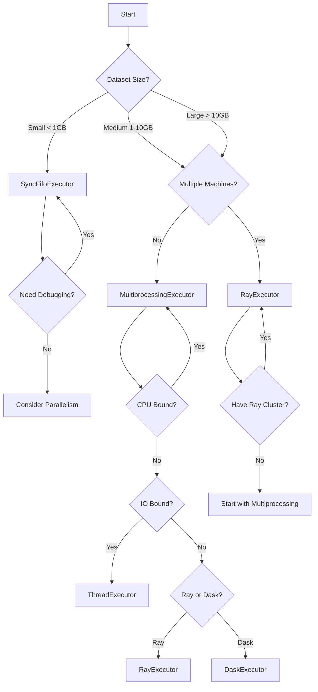

# Executors

Executors define **how** the data flows through the Pipe system. They handle the validation logic and can process data sequentially or in parallel.

## Overview

Pipe provides three types of executors:

| Executor | Use Case | Parallelism | Best For |
|----------|----------|-------------|----------|
| `SyncFifoExecutor` | Simple processing | None | Small datasets, debugging |
| `MultiprocessingExecutor` | CPU-bound tasks | Multiple processes | Large datasets on single machine |
| `ThreadExecutor` | IO-bound tasks | Multiple threads | Network requests, DB queries, high concurrency |
| `AsyncIOExecutor` | Async workflows | Asyncio concurrency | Async hooks, async I/O workflows |
| `DaskExecutor` | ETL, Dataframe-style workflows | Dask cluster | Data transformations, existing Dask infra |
| `RayExecutor` | Distributed processing | Ray cluster | Very large datasets, multiple machines |

---

## SyncFifoExecutor

Processes entries one by one in a synchronous, first-in-first-out manner.

### Features

- Simple and straightforward
- No overhead from parallelization
- Easy to debug
- Ideal for small to medium datasets

### Usage

```python
from zoopipe.executor.sync_fifo import SyncFifoExecutor

executor = SyncFifoExecutor(YourSchema)
```

### Parameters

- `schema_model` (required): Your Pydantic model class

---

## MultiprocessingExecutor

Leverages Python's multiprocessing to process data in parallel across multiple CPU cores.

### Features

- **Parallel Processing**: Utilizes multiple CPU cores
- **Configurable Workers**: Control the number of parallel processes
- **Batch Processing**: Process data in configurable chunks
- **Binary Serialization**: Uses msgpack for efficient inter-process communication
- **Optional Compression**: LZ4 compression to reduce memory usage
- **Perfect for CPU-intensive transformations** on a single machine

### Usage

```python
from zoopipe.executor.multiprocessing import MultiProcessingExecutor

executor = MultiProcessingExecutor(
    schema_model=YourSchema,
    max_workers=4,
    chunksize=100,
    compression="lz4"
)
```

### Parameters

- `schema_model` (required): Your Pydantic model class
- `max_workers` (optional): Number of parallel processes. Defaults to `None` (uses all CPU cores)
- `chunksize` (optional): Number of entries to process per chunk. Default: `1`
- `compression` (optional): Compression algorithm. Options: `"lz4"` or `None`. Default: `None`

### Performance Tips

- Set `max_workers` to the number of CPU cores for CPU-bound tasks
- Increase `chunksize` for better throughput (reduces overhead)
- Use `compression="lz4"` if your data is large and memory is a concern
- Balance between `max_workers` and `chunksize` based on your data size

---

## ThreadExecutor

Uses a thread pool for concurrent execution. This is lighter than multiprocessing as threads share memory.

### Features

- **Concurrent Processing**: Utilizes multiple threads
- **Low Overhead**: No need for data serialization (msgpack) or inter-process communication
- **IO-Bound Optimized**: Ideal for tasks waiting on network or disk (e.g., calling APIs in hooks)
- **No GIL Release**: Not suitable for CPU-heavy Python code (due to GIL), but great for Pydantic (which releases GIL) or IO.

### Usage

```python
from zoopipe.executor.thread import ThreadExecutor

executor = ThreadExecutor(
    schema_model=YourSchema,
    max_workers=10,
    chunksize=1
)
```

### Parameters

- `schema_model` (required): Your Pydantic model class
- `max_workers` (optional): Number of threads. Defaults to `None` (based on CPU count * 5)
- `chunksize` (optional): Number of entries per task. usually `1` is fine for threads.

---

## AsyncIOExecutor

Uses asyncio for concurrent execution with support for async hooks and integration with async frameworks.

### Features

- **Asyncio Integration**: Native support for async/await patterns
- **Concurrent Processing**: Configurable concurrency level for parallel task execution
- **Async Hook Support**: Automatically detects and executes async hooks
- **Mixed Hook Support**: Can handle both sync and async hooks in the same pipeline
- **Event Loop Integration**: Can integrate with existing event loops
- **Thread Pool Fallback**: Uses thread pool for CPU-bound operations
- **Ideal for async I/O workflows** with async hooks or async data sources

### Usage

```python
from zoopipe.executor.asyncio import AsyncIOExecutor

executor = AsyncIOExecutor(
    schema_model=YourSchema,
    concurrency=10,
    max_workers=4
)
```

### Parameters

- `schema_model` (required): Your Pydantic model class
- `concurrency` (optional): Maximum number of concurrent async tasks. Default: `10`
- `max_workers` (optional): Number of threads for thread pool executor. Default: `None` (auto)
- `use_batch_validation` (optional): Use batch validation if supported. Default: `False`
- `loop` (optional): Existing asyncio event loop to use. Default: `None` (creates new loop)

### Use Cases

**Async Hooks Integration**
```python
from zoopipe.executor.asyncio import AsyncIOExecutor
from zoopipe.hooks.base import BaseHook

class AsyncAPIEnrichmentHook(BaseHook):
    async def execute(self, entries, store):
        async with aiohttp.ClientSession() as session:
            for entry in entries:
                async with session.get(f"https://api.example.com/{entry['raw_data']['id']}") as resp:
                    data = await resp.json()
                    entry['raw_data']['enriched'] = data
        return entries

executor = AsyncIOExecutor(
    schema_model=YourSchema,
    concurrency=20
)

pipe = Pipe(
    input_adapter=input_adapter,
    output_adapter=output_adapter,
    executor=executor,
    pre_validation_hooks=[AsyncAPIEnrichmentHook()]
)
```

### Performance Tips

- Set `concurrency` based on I/O wait time (higher for slower I/O operations)
- Use async hooks for network calls, database queries, and file I/O
- Adjust `max_workers` for CPU-bound validation workloads
- Can integrate with existing event loop if needed

---

## DaskExecutor

Uses Dask for distributed parallel processing. Ideal for ETL workflows or if you already have a Dask cluster (e.g., Coiled, Saturn Cloud).

### Features

- **Distributed Processing**: Scales across Dask clusters
- **Lazy Execution**: Uses Dask futures for efficient task scheduling
- **Binary Packing**: Uses msgpack for efficient transfer
- **ETL Friendly**: Matches the "Big Pandas" mental model

### Usage

```python
from zoopipe.executor.dask import DaskExecutor

# Connect to a local cluster (auto-created) or existing scheduler
executor = DaskExecutor(
    schema_model=YourSchema,
    address="tcp://scheduler-address:8786",  # Optional
    compression="lz4" # Optional
)
```

### Parameters

- `schema_model` (required): Your Pydantic model class
- `address` (optional): Dask scheduler address. If `None`, creates a `dask.distributed.Client` (which might start a local cluster).
- `compression` (optional): Compression algorithm (`"lz4"` or `None`).

---

## RayExecutor

Uses Ray for distributed parallel processing across multiple machines or containers.

### Features

- **Distributed Processing**: Can scale across multiple machines
- **Ray Cluster Support**: Connect to existing Ray clusters
- **Configurable Concurrency**: Control max in-flight tasks
- **Binary Serialization**: Uses msgpack with optional LZ4 compression
- **Ideal for large-scale data processing** and I/O-bound tasks
- **Best when scaling beyond a single machine**

### Usage

#### Local Mode

```python
from zoopipe.executor.ray import RayExecutor

executor = RayExecutor(
    schema_model=YourSchema,
    compression="lz4",
    max_inflight=20
)
```

#### Connect to Ray Cluster

```python
executor = RayExecutor(
    schema_model=YourSchema,
    address="ray://your-cluster-address:10001",
    compression="lz4"
)
```

#### Auto-discovery

```python
executor = RayExecutor(
    schema_model=YourSchema,
    address="auto",
    compression="lz4"
)
```

### Parameters

- `schema_model` (required): Your Pydantic model class
- `address` (optional): Ray cluster address. Options:
  - `None`: Start Ray locally
  - `"auto"`: Auto-discover Ray cluster
  - `"ray://host:port"`: Connect to specific cluster
- `compression` (optional): Compression algorithm. Options: `"lz4"` or `None`. Default: `None`
- `max_inflight` (optional): Maximum number of concurrent tasks in flight. Default: `20`

### Performance Tips

- Use Ray when processing very large datasets (>1GB)
- Connect to a Ray cluster for distributed processing
- Use `compression="lz4"` to reduce network overhead in distributed scenarios
- Adjust `max_inflight` based on your cluster capacity (default is 20 for optimal throughput)

---

## Unified Processing Architecture

All executors share a common processing pipeline implemented in `BaseExecutor.process_chunk_on_worker`. This method provides a unified, standardized approach to data processing across all executor types.

### Processing Pipeline

The unified pipeline follows these steps:

1. **Data Unpacking**: Automatically handles decompression (LZ4) and deserialization (msgpack) if binary packing is enabled
2. **Pre-validation Hooks**: Execute hooks on raw data before validation
3. **Schema Validation**: Validate each entry against the Pydantic schema
4. **Post-validation Hooks**: Execute hooks on validated data after validation
5. **Results Collection**: Collect all processed entries for output

### Key Benefits

- **Consistency**: All executors follow the same processing order
- **Centralized Logic**: Unpacking and hook orchestration in one place
- **Thread-Safe**: Each worker has its own `HookStore` with proper locking
- **Error Handling**: Standardized error handling across all executor types

### Hook Execution

The pipeline supports two types of hooks:

- **Pre-validation Hooks**: Run before Pydantic validation, can modify raw data
- **Post-validation Hooks**: Run after successful validation, can enrich validated data

Hooks are executed in the order they were registered, and the `HookStore` is locked during execution to ensure thread safety.

---

## Binary Serialization & Compression

Both `MultiprocessingExecutor` and `RayExecutor` use an optimized transport stack:

### Serialization: msgpack

- **Lightweight**: Smaller payload than JSON or Pickle
- **Fast**: High serialization/deserialization speed
- **Type-aware**: Preserves Python types

### Error Handling in Hooks

Executors automatically catch exceptions raised by hooks. If a hook fails:
1.  The entry status is set to `EntryStatus.FAILED`.
2.  The error is appended to the entry's `errors` list in the format `{"type": "HookError", "message": "HookName: Error details"}`.
3.  Validation and subsequent hooks are skipped for that entry.
4.  The failed entry is included in the `FlowReport.error_count`.

### Compression: LZ4

- **Optional**: Enable with `compression="lz4"`
- **Low Latency**: Fast compression and decompression
- **High Speed**: Optimized for decompression speed
- **Memory Efficient**: Reduces memory usage in inter-process communication

### When to Use Compression

✅ **Use LZ4 compression when:**
- Processing very large datasets
- Memory is a constraint
- Network bandwidth is limited (for Ray distributed scenarios)
- Data is highly compressible (text, repeated patterns)

❌ **Skip compression when:**
- Processing small datasets
- CPU is the bottleneck
- Data is already compressed (images, videos)

---

## Choosing the Right Executor



### Decision Matrix

| Scenario | Recommended Executor | Reason |
|----------|---------------------|--------|
| Small CSV validation | `SyncFifoExecutor` | Simple, no overhead |
| Large CSV processing | `MultiprocessingExecutor` | Parallel on single machine |
| ETL from database | `MultiprocessingExecutor` | CPU-bound transformations |
| API Enrichment | `ThreadExecutor` or `AsyncIOExecutor` | IO-bound (waiting for network) |
| Massive data migration | `RayExecutor` | Distributed processing |
| Real-time streaming | `SyncFifoExecutor` | Low latency |
| Batch processing pipeline | `MultiprocessingExecutor` or `RayExecutor` | Throughput optimization |
