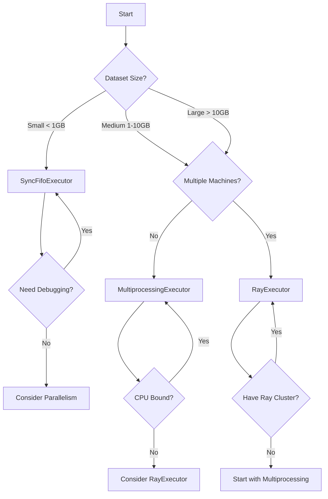

# Executors

Executors define **how** the data flows through the FlowSchema system. They handle the validation logic and can process data sequentially or in parallel.

## Overview

FlowSchema provides three types of executors:

| Executor | Use Case | Parallelism | Best For |
|----------|----------|-------------|----------|
| `SyncFifoExecutor` | Simple processing | None | Small datasets, debugging |
| `MultiprocessingExecutor` | CPU-bound tasks | Multiple processes | Large datasets on single machine |
| `RayExecutor` | Distributed processing | Ray cluster | Very large datasets, multiple machines |

---

## SyncFifoExecutor

Processes entries one by one in a synchronous, first-in-first-out manner.

### Features

- Simple and straightforward
- No overhead from parallelization
- Easy to debug
- Ideal for small to medium datasets

### Usage

```python
from flowschema.executor.sync_fifo import SyncFifoExecutor

executor = SyncFifoExecutor(YourSchema)
```

### Parameters

- `schema_model` (required): Your Pydantic model class

---

## MultiprocessingExecutor

Leverages Python's multiprocessing to process data in parallel across multiple CPU cores.

### Features

- **Parallel Processing**: Utilizes multiple CPU cores
- **Configurable Workers**: Control the number of parallel processes
- **Batch Processing**: Process data in configurable chunks
- **Binary Serialization**: Uses msgpack for efficient inter-process communication
- **Optional Compression**: LZ4 compression to reduce memory usage
- **Perfect for CPU-intensive transformations** on a single machine

### Usage

```python
from flowschema.executor.multiprocessing import MultiProcessingExecutor

executor = MultiProcessingExecutor(
    schema_model=YourSchema,
    max_workers=4,
    chunksize=100,
    compression="lz4"
)
```

### Parameters

- `schema_model` (required): Your Pydantic model class
- `max_workers` (optional): Number of parallel processes. Defaults to `None` (uses all CPU cores)
- `chunksize` (optional): Number of entries to process per chunk. Default: `1`
- `compression` (optional): Compression algorithm. Options: `"lz4"` or `None`. Default: `None`

### Performance Tips

- Set `max_workers` to the number of CPU cores for CPU-bound tasks
- Increase `chunksize` for better throughput (reduces overhead)
- Use `compression="lz4"` if your data is large and memory is a concern
- Balance between `max_workers` and `chunksize` based on your data size

---

## RayExecutor

Uses Ray for distributed parallel processing across multiple machines or containers.

### Features

- **Distributed Processing**: Can scale across multiple machines
- **Ray Cluster Support**: Connect to existing Ray clusters
- **Configurable Concurrency**: Control max in-flight tasks
- **Binary Serialization**: Uses msgpack with optional LZ4 compression
- **Ideal for large-scale data processing** and I/O-bound tasks
- **Best when scaling beyond a single machine**

### Usage

#### Local Mode

```python
from flowschema.executor.ray import RayExecutor

executor = RayExecutor(
    schema_model=YourSchema,
    compression="lz4"
)
```

#### Connect to Ray Cluster

```python
executor = RayExecutor(
    schema_model=YourSchema,
    address="ray://your-cluster-address:10001",
    compression="lz4"
)
```

#### Auto-discovery

```python
executor = RayExecutor(
    schema_model=YourSchema,
    address="auto",
    compression="lz4"
)
```

### Parameters

- `schema_model` (required): Your Pydantic model class
- `address` (optional): Ray cluster address. Options:
  - `None`: Start Ray locally
  - `"auto"`: Auto-discover Ray cluster
  - `"ray://host:port"`: Connect to specific cluster
- `compression` (optional): Compression algorithm. Options: `"lz4"` or `None`. Default: `None`

### Performance Tips

- Use Ray when processing very large datasets (>1GB)
- Connect to a Ray cluster for distributed processing
- Use `compression="lz4"` to reduce network overhead in distributed scenarios
- The executor maintains 20 in-flight tasks by default for optimal throughput

---

## Binary Serialization & Compression

Both `MultiprocessingExecutor` and `RayExecutor` use an optimized transport stack:

### Serialization: msgpack

- **Lightweight**: Smaller payload than JSON or Pickle
- **Fast**: High serialization/deserialization speed
- **Type-aware**: Preserves Python types

### Compression: LZ4

- **Optional**: Enable with `compression="lz4"`
- **Low Latency**: Fast compression and decompression
- **High Speed**: Optimized for decompression speed
- **Memory Efficient**: Reduces memory usage in inter-process communication

### When to Use Compression

✅ **Use LZ4 compression when:**
- Processing very large datasets
- Memory is a constraint
- Network bandwidth is limited (for Ray distributed scenarios)
- Data is highly compressible (text, repeated patterns)

❌ **Skip compression when:**
- Processing small datasets
- CPU is the bottleneck
- Data is already compressed (images, videos)

---

## Choosing the Right Executor



### Decision Matrix

| Scenario | Recommended Executor | Reason |
|----------|---------------------|--------|
| Small CSV validation | `SyncFifoExecutor` | Simple, no overhead |
| Large CSV processing | `MultiprocessingExecutor` | Parallel on single machine |
| ETL from database | `MultiprocessingExecutor` | CPU-bound transformations |
| Massive data migration | `RayExecutor` | Distributed processing |
| Real-time streaming | `SyncFifoExecutor` | Low latency |
| Batch processing pipeline | `MultiprocessingExecutor` or `RayExecutor` | Throughput optimization |
